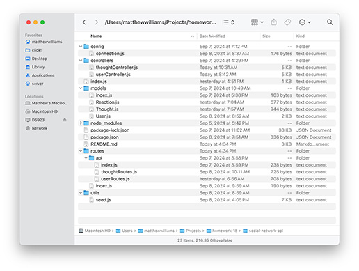
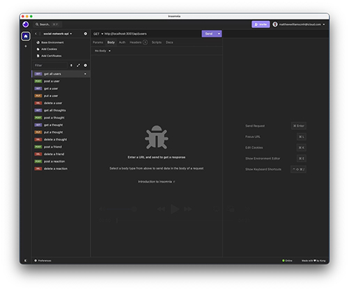

# Social-Networking API

## License

MIT License

## Description 
This repo includes code for a social-networking API to run on an Express server using Node.js. The API includes fourteen routes and their accompanying back-end logic. The routes allow users to GET a list of all users and thoughts (posts), GET the properties of individual users and thoughts, PUT (update) users and thoughts, and POST and DELETE users, thoughts, friends, and reactions (comments on posts). The data is stored as documents in Mongodb collections. The API relies on Mongoose for database-function handling.

## Table of Contents
- [Installation](#installation)
- [Usage](#usage)
- [License](#license)
- [Contributing](#contributing)
- [Tests](#tests)
- [Questions](#questions)

## Installation
As a back-end application, the Social-Networking API does not require installation, per se, but to use it, download this repo being careful not to change the file and folder structure as shown in the image below.

## Usage
To deploy the Social-Networking API, make sure you have Mongodb installed an running on your computer, then execute these CLI commands from the root folder (the one that includes the config folder):

    npm install [installs dependences]
    npm run seed [seeds the database, socialdb, that Mongodb will create]
    npm start [to start the server]

Once initiated and seeded, you can test the Social-Networking API routes using Insomnia or a similar application. Make sure, of course, that for POST and PUT requests your tests include a body specifying the needed data: email, userID, etc. For other routes, be sure to include IDs in the http requests. To see a video of the application routes being tested in Insomnia, click on the link below. Note: Depending on the environment in which you're viewing this README file, you may not be able to view the video online, in which case, you should be able to download and view it locally. A copy can also be found in the assets folder in the repo and on my Google drive at this link: https://drive.google.com/file/d/1MDOulir-j2TL1bVYuKBRhoIxJvA4O1-U/view?usp=sharing.

## Contributing
To contribute to the Social-Networking API, clone this repository locally and commit your code to a separate branch.

## Tests
If you are making core library changes, please write unit tests for your code and ensure that everything is working correctly before opening a pull request.

## Questions
You can see my github repositories at [MatthewWilliamsCMH](https://github.com/MatthewWilliamsCMH/).  
Drop me a line at [matthewwilliamscmh@icloud.com](mailto:matthewwilliamscmh@icloud.com).